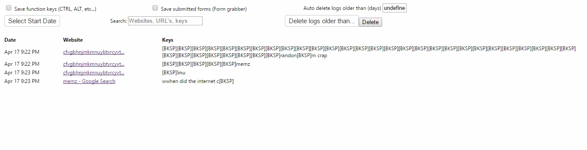
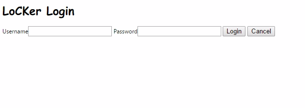

# ChromeExT-Locker
Chrome Extension Keylogger with login

Defalt username and password is root

Checks if you goto the page with the logs without entering a username and a password.

# WARNING - THIS IS NOT FULLY SECURE! THE SHA-512 HASH IS OPEN FOR VIEWING! 

# Images
 

# Credit!
The guy who made the keylogger - https://www.ericzhang.me/projects/chromelogger/
sha-512 javascript - http://pajhome.org.uk/crypt/md5/
